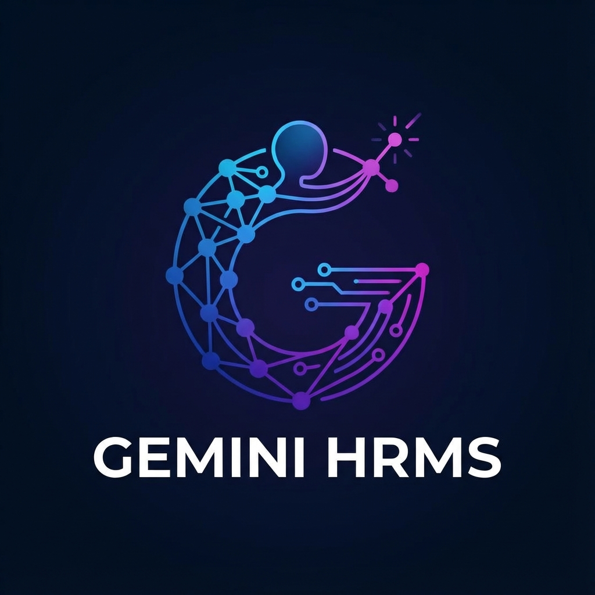
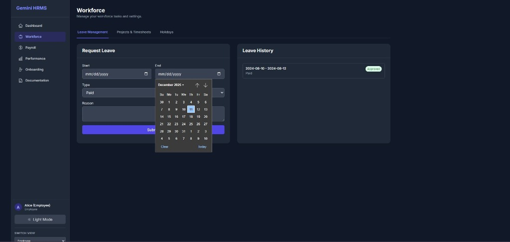
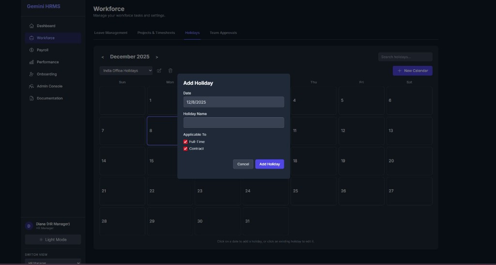
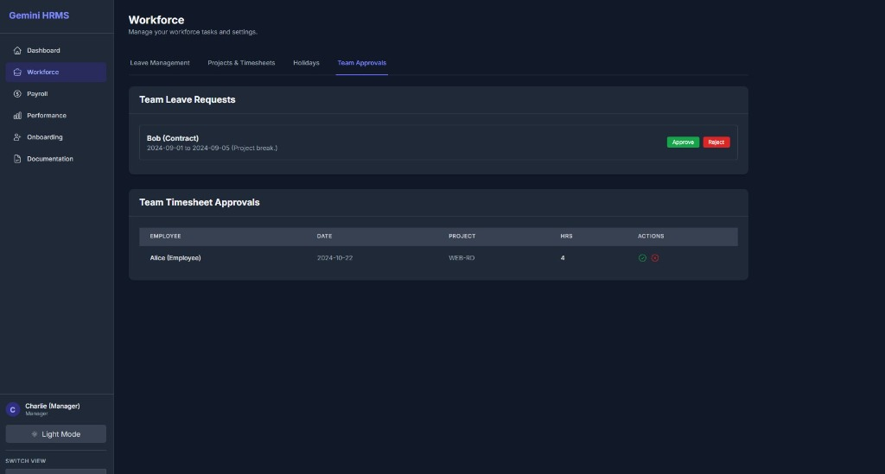
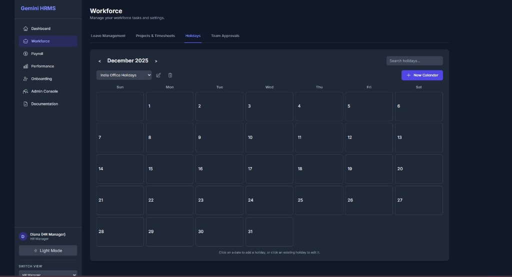

  

# Gemini HRMS – AI-Driven Workforce Management Suite

Gemini HRMS is a comprehensive Human Resource Management System designed to modernize workforce operations by integrating Google's Gemini AI directly into core administrative workflows. It moves beyond traditional data entry by using AI to automate complex processes like identity verification and policy creation.

The platform offers a full suite of modules including Workforce Management (Leave & Timesheets), Payroll (Payslips & Tax), Performance (OKRs & Appraisals), and Onboarding.

## Key Innovations

- **AI Policy Engine**: utilizing Gemini 2.5 Pro with "Thinking" capabilities, this feature allows HR admins to type complex leave policies in plain English (e.g., "Contractors get 10 days unpaid, Full-time get 20 paid..."), which the AI instantly converts into structured, enforceable system rules.
- **Automated KYC Onboarding**: uses multimodal AI to analyze uploaded ID documents, compare them against user-submitted data for instant verification, and provides audio feedback via Gemini's Text-to-Speech.
- **Smart Workflow Logic**: Features intelligent holiday overlap detection during leave requests and role-based dashboards for Employees, Managers, and Admins.

## Key Screenshots

### 1. The AI Policy Engine (Admin Console)

*Administrators can generate complex system configurations simply by describing them in plain English using the AI Policy Engine.*

### 2. Intelligent Onboarding & KYC Verification
*(Note: Screenshot not identified in uploaded batch, displaying Gallery below)*
<!-- Since I can't be 100% sure of the mapping without seeing them, I will provide a gallery of all uploaded screenshots for completeness -->

### Gallery

## Run Locally

**Prerequisites:**  Node.js

1. Install dependencies:
   `npm install`
2. Set the `GEMINI_API_KEY` in [.env.local](.env.local) to your Gemini API key
3. Run the app:
   `npm run dev`
